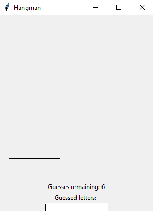
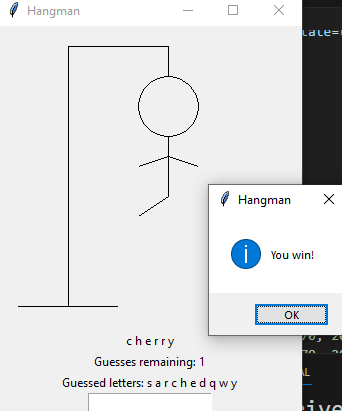

# Hangman Game

🎮 Welcome to the Hangman game! This is a classic word-guessing game implemented using the tkinter library in Python. Test your vocabulary skills and try to guess the hidden word before the hangman is complete! 




## How to Play

🔤 Run the Python script using a Python interpreter. A window will appear with a canvas displaying a scaffold for the hangman. The word to guess will be represented by blank spaces, and the number of guesses remaining will be displayed.

🔠 Enter a single letter in the entry field and press Enter to make a guess. If the guessed letter is in the word, it will be revealed in the word display. If the letter is not in the word, the hangman will be drawn step by step, and the number of guesses remaining will decrease.

🔄 Keep guessing letters until you either guess the word correctly or run out of guesses. If you win, a congratulatory message will be displayed, and you can choose to retry the game or exit. If you lose, a message will be displayed with the correct word, and you can choose to retry the game or exit.

## Dependencies

The following dependencies are required to run the Hangman game:

- Python 3.x
- tkinter library
- playsound library

You can install the required libraries using the following commands:

```
pip install tkinter
pip install playsound
```

Note: The playsound library requires the availability of a media player on your system to play the sound effects.

## Project Structure

The Hangman game consists of the following components:

- 📝 `words`: A list of words from which the game selects a random word to be guessed.
- 🔢 `guesses`: The number of remaining guesses.
- 🈲 `guessed_letters`: A list of letters that have been guessed.
- 🖼️ `root`: The main window of the game.
- 🖌️ `canvas`: The canvas for drawing the hangman.
- 🏷️ `word_label`: A label for displaying the word with blank spaces and correctly guessed letters.
- 🎯 `guesses_label`: A label for displaying the number of remaining guesses.
- 📚 `guessed_label`: A label for displaying the letters that have been guessed.
- 🖊️ `guess_entry`: An entry field for the player to input their guesses.
- ✅ `check_guess()`: A function to check the player's guess and update the game state accordingly.
- 🔁 `retry_game()`: A function to reset the game and start a new round.
- 🛑 `exit_game()`: A function to exit the game.
- 🔁 `retry_button`: A button to retry the game.
- 🛑 `exit_button`: A button to exit the game.

## How to Contribute

🎁 If you'd like to contribute to this project, you can follow these steps:

1. 🍴 Fork the repository and clone it to your local machine.
2. 🛠️ Make your changes or add new features.
3. ✔️ Test the changes to ensure everything is working correctly.
4. 📝 Commit your changes and push them to your forked repository.
5. 🔄 Submit a pull request explaining the changes you've made.

## Credits

🙌 This project is based on the Hangman game implemented in Python using the tkinter library. The game logic and graphical elements were created by me.

Feel free to improve and enhance this project. Enjoy playing Hangman! 🎉
